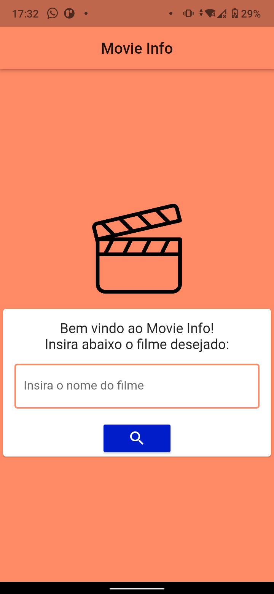
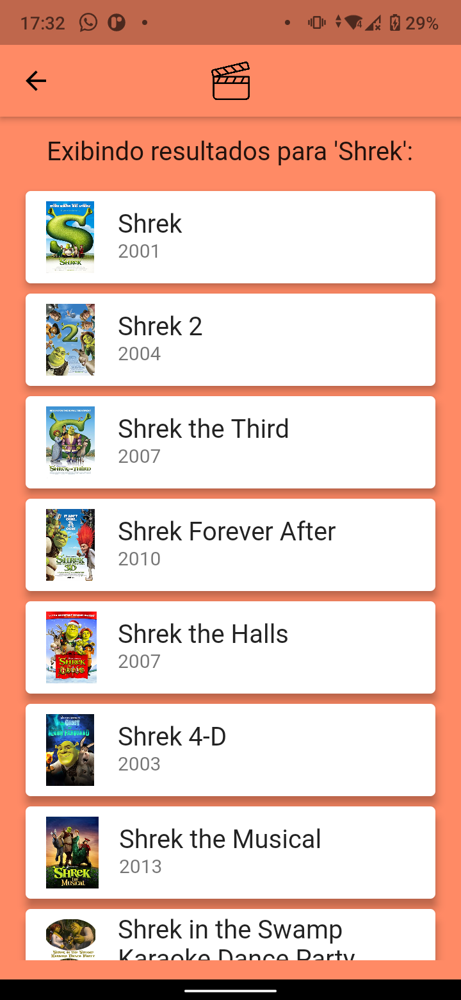
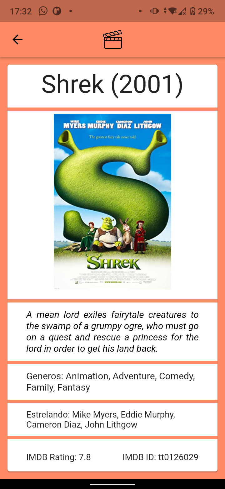

# Movie App

<ol>
    <li><a href="#sobre">Sobre</a></li>
    <li> <a href="#especificacoes">Especificações</a></li>
    <li> <a href="#comorodaroprojeto">Como Rodar o Projeto?</a> </li>
</ol>

<h2 id="sobre">Sobre</h2>

Movie App é um aplicativo criado para testar os meus conhecimentos em Flutter. O aplicativo consume a API do OMDB

<h2 id="especificacoes">Sobre</h2>

O app foi feito usando o FrameWork Flutter e a API do OMBD, exibindo para o usuário os resultados de acordo com a String digitada pelo usuário.

    
    
    

    
    
<h2 id="comorodaroprojeto">Como Rodar o Projeto?</h2>

Para rodar o projeto você deve ter o <a href="https://docs.flutter.dev/get-started/install">Flutter</a> instalado em sua máquina. Com o Flutter instalado, basta clonar o repositório para sua máquina, entrar no repositório clonado e digitar no terminal:

``
flutter run
``

Para executar o projeto em seu dispositivo.

<!-- 
This project is a starting point for a Flutter application.

A few resources to get you started if this is your first Flutter project:

- [Lab: Write your first Flutter app](https://flutter.dev/docs/get-started/codelab)
- [Cookbook: Useful Flutter samples](https://flutter.dev/docs/cookbook)

For help getting started with Flutter, view our
[online documentation](https://flutter.dev/docs), which offers tutorials,
samples, guidance on mobile development, and a full API reference.
 -->
